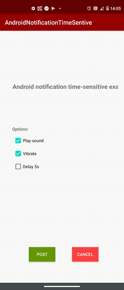

## Android example of how to post a time-sensitive notification in Kotlin

## Display time-sensitive notifications:
In specific situations, your app might need to get the user's attention urgently, such as an ongoing alarm or incoming call. You might have previously configured your app for this purpose by launching an activity while your app was in the background.

## Note:
The Android may choose to display a heads-up notification, instead of launching your full-screen intent, while the user is using the device.

### This app show how to use:
* Kotlin
* Notification
    * Time-sensitive
    * Head up
    * Actions buttons background colors with *Android spannable*
* Service Foreground
* MediaPlayer (Play a sound)
* Vibrator (Vibrator loop)
* FullScreen Activity (Open the screen over the keyguard and screen off)
* ConstraintLayout
* Marquee textView



## Permissions:
```
<uses-permission android:name="android.permission.FOREGROUND_SERVICE" />
<uses-permission android:name="android.permission.USE_FULL_SCREEN_INTENT" />
<uses-permission android:name="android.permission.VIBRATE" />
```

## References:
https://developer.android.com/training/notify-user/build-notification
https://developer.android.com/training/notify-user/time-sensitive
https://developer.android.com/guide/components/services
https://developer.android.com/reference/android/text/Spannable
https://developer.android.com/guide/components/foreground-services
https://androidwave.com/foreground-service-android-example-in-kotlin/

